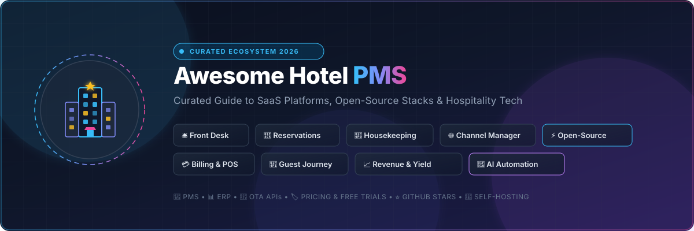
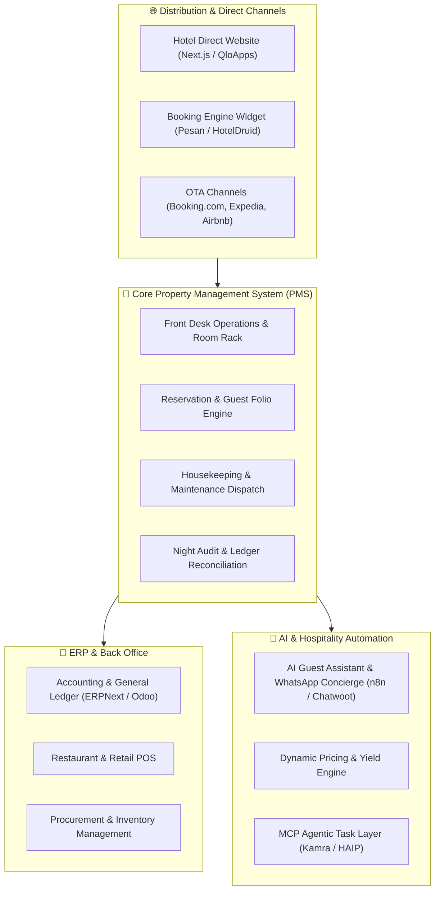

  

  
  
  
  
  
  
  

# 🏨 Awesome Hotel Property Management System (PMS)

> 🌟 **A curated directory of top Commercial SaaS Platforms and Open-Source GitHub Projects for Hotel Property Management Systems (PMS), Hospitality ERPs, Direct Booking Engines, Channel Managers, and Hotel Automation Stacks.**

---

## 📑 Table of Contents

- [🌐 Overview & Ecosystem](#-overview--ecosystem)
- [🏢 SaaS & Hosted Platforms](#-saas--hosted-platforms)
- [⚡ Open-Source GitHub Projects](#-open-source-github-projects)
- [🏗️ Architectural Blueprint for Self-Hosted Hotel Tech](#️-architectural-blueprint-for-self-hosted-hotel-tech)
- [📈 Star History](#-star-history)
- [🤝 How to Contribute](#-how-to-contribute)
- [⚠️ Disclaimer](#️-disclaimer)

---

## 🌐 Overview & Ecosystem

A **Hotel Property Management System (PMS)** serves as the operational central nervous system for lodging properties — spanning boutique hotels, luxury resorts, hostels, serviced apartments, vacation rentals, campgrounds, and global hotel chains. Modern PMS solutions streamline:

* 🛎️ **Front Desk & Concierge:** Guest check-in/check-out, keycard encoders, folio management, and room allocation.
* 📅 **Reservation Management:** Real-time room availability, direct booking engines, group bookings, and rates.
* 🌐 **Channel Management:** 2-way sync with OTAs (Online Travel Agencies like Booking.com, Expedia, Airbnb, Agoda) and GDS (Global Distribution Systems).
* 🧹 **Housekeeping & Maintenance:** Real-time room status updates, housekeeping task assignment, and defect ticketing.
* 💳 **Point of Sale (POS) & Billing:** Integrated restaurant/bar billing, night audit automation, payment gateways, and tax invoicing.
* 📈 **Revenue Management & Yield Optimization:** Dynamic rate adjustment based on occupancy, demand surges, and competitor pricing.
* 🤖 **Guest Journey & AI Automation:** Contactless check-in, WhatsApp/SMS guest communication, and AI concierge agents.

---

## 🏢 SaaS & Hosted Platforms

> 📊 **Market Overview & Structure**: The global Hotel Property Management System (PMS) and Hospitality Software market is estimated at **$4.5B – $6.8B (2025/2026)** and is projected to expand to **$11.2B+ by 2030** at a CAGR of **~8.6% – 9.2%**. The industry is **moderately to highly fragmented** (rather than a winner-take-all market) due to diverse accommodation tiers (independent boutiques, B&Bs, vacation rentals, luxury resort chains), regional fiscal/tax compliance requirements, and custom tech integration workflows.

*The table below compares leading commercial hotel PMS and hospitality management SaaS platforms, sorted in descending order by **Company Size / Valuation / ARR**.*

| 🏨 SaaS Product | 💼 Company Size / Valuation / ARR | 💵 Starting Tier / Pricing | 🎁 Free Tier / Free Trial Limits | 🎯 Target Segment & Core Capabilities |
| :--- | :--- | :--- | :--- | :--- |
| **[Oracle OPERA Cloud](https://www.oracle.com/hospitality/hotel-property-management/)** | **~$400B+ Market Cap** (NYSE: ORCL; ~$1B+ est. Hospitality ARR) | **~$700/month** base quote (Enterprise volume ~approx. $50/room/mo; plus setup/migration fees) | **No self-serve free trial** (Guided enterprise demo & cloud tour upon sales request) | Mid-to-large luxury hotels, resorts, casino hotels, and global multi-property chains. |
| **[eZee Absolute](https://www.ezeetechnosys.com/hotel-pms/)** (Yanolja Cloud) | **~$2.5B+ Parent Valuation** (Yanolja $750M+ rev; $20M–$40M division ARR) | **~$27 – $40/month** (Base PMS; modular add-ons for Channel Manager & Booking Engine) | **14-day free trial** (Full sandbox with pre-configured/live data; external hardware APIs disabled) | Budget-to-midscale hotels, serviced apartments, resorts, and boutique accommodation groups. |
| **[Mews](https://www.mews.com/)** | **$2.5B Valuation** ($300M Series D in Jan 2026; $100M–$200M+ ARR) | **~€300 – €500/month** (Essentials plan; typically ~$8–$14/room/mo equivalent) | **No self-serve free trial** (Personalized product demo and pilot onboarding) | Modern boutique hotels, lifestyle hotel chains, urban hostels, and hybrid hospitality spaces. |
| **[Little Hotelier](https://www.littlehotelier.com/)** (SiteMinder) | **~$1.1B+ AUD Market Cap** (ASX: SDR; $313.7M ARR) | **$39/month** (Basics plan + 1% booking fee) or **$109/month** (Pro plan, 0% fee) | **30-day free trial** (Full access to PMS, booking engine & channel manager; no lock-in contract) | Small accommodation providers, B&Bs, boutique guest houses, and inns (1–30 rooms). |
| **[Cloudbeds](https://www.cloudbeds.com/)** | **$1.0B+ Valuation** ($100M+ ARR; SoftBank Vision Fund 2 backed) | **~$180/month** (Flex tier; One plan ~$220/mo, Experience plan ~$320/mo) | **No self-serve free trial** (Personalized interactive product demo only) | Independent boutique hotels, hostels, hotel groups, and vacation rental portfolios. |
| **[Guesty](https://www.guesty.com/)** | **$900M Valuation** ($160M+ ARR; Series F $130M led by KKR) | **$9/listing/month** (Guesty Lite plan; Pro & Enterprise custom volume tiers) | **14-day free trial** (Available on Guesty Lite for portfolios with 1–3 listings) | Vacation rentals, aparthotels, short-term rentals, and multi-unit hospitality operators. |
| **[Hostaway](https://www.hostaway.com/)** | **$600M – $800M+ Est. Valuation** ($543M+ Funding; $30M–$50M+ ARR) | **~$25 – $50/listing/month** (Custom quote scaled by portfolio size; onboarding fee ~$300–$1,000) | **No self-serve free trial** (Personalized live product walkthrough demo only) | Professional vacation rental property managers, urban multi-property operators. |
| **[HotelKey](https://www.hotelkey.com/)** | **$300M – $500M Est. Valuation** ($40M–$60M+ ARR; 4,000+ properties) | **$4/room/month** (Core cloud PMS module; enterprise minimums apply) | **No self-serve free trial** (14-day test environment available upon consultation/demo) | Independent hotels, regional chains, and enterprise brand operators (e.g., Hilton, G6). |
| **[RMS Cloud](https://www.rmscloud.com/)** | **$200M – $350M Est. Valuation** ($40M–$60M ARR; 6,500+ properties) | **~$55/month** base (or ~$7–$10/unit/month for small properties; plus setup fee) | **No self-serve free trial** (Dedicated consultative demo only) | RV parks, campgrounds, holiday parks, boutique hotels, and multi-property chains. |
| **[Lodgify](https://www.lodgify.com/)** | **$150M – $250M Est. Valuation** ($37.3M Series B; $25M–$50M+ ARR) | **$13 – $14/month** (Starter tier billed annually for 1 rental; Pro from $38/mo) | **7-day free trial** (Full platform features & website builder; no credit card required) | Vacation rental hosts, cabin rentals, villas, and independent accommodation managers. |
| **[Amenitiz](https://amenitiz.com/)** | **$150M – $250M Est. Valuation** ($45M+ Series B; $15M–$30M ARR) | **€42/month** (Presence/Sales Pro tier; Ultimate+ all-in-one tier ~€69/mo) | **No self-serve free trial** (Free live demo; "Live in 30 days or first month free" guarantee) | Independent hoteliers, B&Bs, rural lodges, and boutique guest accommodations in Europe. |
| **[SIHOT](https://www.sihot.com/)** (GUBSE AG) | **$100M – $200M Est. Valuation** ($25M–$45M ARR; 3,500+ properties) | **~$100 – $250/month** base quote (Modular pricing based on room count & activated tools) | **No self-serve free trial** (Tailored product demo & sandbox evaluation on request) | Full-service hotels, hotel chains, conference resorts, and leisure accommodation groups. |
| **[Stayntouch](https://www.stayntouch.com/)** (MCR Hotels) | **$200M+ Invested / $46M Acquisition** ($25M–$50M+ ARR; MCR portfolio) | **~$800/month** base subscription (or ~$3–$6/room/month at volume; unmetered integrations) | **No self-serve free trial** (Live guided product demo with implementation consultants) | Independent boutique hotels, luxury resorts, and full-service lifestyle properties. |
| **[Maestro PMS](https://www.maestropms.com/)** (Northwind) | **$80M – $150M Est. Valuation** ($20M–$40M ARR; 800+ resorts) | **$900 base license** (Enterprise full installations start around ~$25,000 one-time) | **No self-serve free trial** (Personalized enterprise walkthrough demo only) | Independent luxury resorts, multi-property hotels, conference centers, and vacation clubs. |
| **[Apaleo](https://apaleo.com/)** | **$80M – $150M Est. Valuation** (€20M Growth round; $12M–$25M ARR) | **€8/room/month** (Subject to a minimum platform spend of **€400/month**) | **Free Developer Sandbox** (Open test environment with mock property & reservation data) | Tech-forward hotel chains, serviced apartments, and accommodation businesses building custom apps. |
| **[Hotelogix](https://www.hotelogix.com/)** | **$60M – $100M Est. Valuation** ($29M+ Funding; $12M–$20M ARR) | **$7.99/room/month** (Premium tier; Premium Plus ~$11.99/rm/mo, Platinum ~$17.99/rm/mo) | **15-day free trial** (Full PMS operational capabilities without long-term commitment) | Budget-to-midscale independent hotels, motels, and small boutique chains. |
| **[RoomRaccoon](https://roomraccoon.com/)** | **$60M – $120M Est. Valuation** ($15M–$30M ARR; FT1000 fast growth) | **$180/month** (Entry tier; Essentials ~$297/mo, Premium ~$397/mo, Pro ~$517/mo) | **30-day free trial** (14–30 day trial granted following initial onboarding demo) | Independent boutique hotels, bed & breakfasts, and boutique apartments (10–100 rooms). |
| **[HotelRunner](https://hotelrunner.com/)** | **$50M – $80M Est. Valuation** ($12.4M Funding; $10M–$20M ARR) | **$19.95/month minimum** (Essential Manage: 0.75%/mo; Essential Sell: 1.25%/mo) | **14-day free trial** (Also offers a limited free starter tier for up to 5 rooms) | Small hotels, boutique inns, hostels, and accommodation suppliers worldwide. |
| **[ResNexus](https://www.resnexus.com/)** | **$50M – $100M Est. Valuation** ($15M–$30M ARR; Bootstrapped) | **~$30/month** (Essentials plan; scales to ~$89/mo; optional direct website hosting from $80/mo) | **30-day free trial** (Risk-free evaluation; no credit card required to start) | Bed & breakfasts, boutique inns, luxury glamping resorts, and campgrounds. |
| **[innRoad](https://www.innroad.com/)** | **$50M – $90M Est. Valuation** ($13.1M Funding; $15M–$30M ARR) | **~$150/month** (Flexible month-to-month subscription with no long-term contracts) | **No self-serve free trial** (Free interactive 1-on-1 walkthrough demo only) | Independent boutique hotels, inns, historic lodges, and regional resorts. |
| **[WebRezPro](https://webrezpro.com/)** (World Web Tech) | **$40M – $80M Est. Valuation** ($10M–$25M ARR; Bootstrapped) | **$10/unit/month** (Strict **$100/month minimum** for 1–14 units; no setup fees) | **No self-serve free trial** (Personalized live product demo only) | Independent hotels, motels, vacation rentals, inns, and hostel properties. |
| **[ThinkReservations](https://thinkreservations.com/)** | **$35M – $70M Est. Valuation** ($8M–$18M ARR; Bootstrapped) | **~$50 – $100/month** (Entry tier for small properties; typical B&B packages ~$100–$150/mo) | **No self-serve free trial** (Personalized consultative demo only) | Boutique hotels, bed & breakfasts, historic inns, and guest lodges. |
| **[Clock PMS+](https://www.clock-software.com/)** (Clock Software) | **$30M – $60M Est. Valuation** ($8M–$18M ARR; Bootstrapped) | **~$100/month** base quote (Typical active subscriptions range **€250 – €810/month**) | **No self-serve free trial** (Custom demo and pilot deployment on request) | Boutique hotel groups, luxury resorts, independent city hotels, and hotel chains. |
| **[RoomKeyPMS](https://www.roomkeypms.com/)** | **$25M – $50M Est. Valuation** ($8M–$18M ARR; Bootstrapped) | **~$100/month** (Quote-based starting baseline tiered by room inventory & integrations) | **No self-serve free trial** (Live product walkthrough & consultation only) | Full-service independent hotels, regional chains, and multi-unit hospitality operators. |
| **[Hotel-Spider](https://www.hotel-spider.com/)** (TourOnline SA) | **$20M – $45M Est. Valuation** ($5M–$15M ARR; Bootstrapped) | **€45/month** (Booking engine Light) / **€89/month** (Channel manager up to 100 products) | **30-day free trial** (Full access to test channel distribution and booking tools) | Independent hotels, boutique lodging providers, and regional hotel groups. |
| **[Preno](https://www.prenohq.com/)** | **$20M – $45M Est. Valuation** ($5M–$12M ARR; Seed/Series A) | **$24/month** (+ 1% booking fee on Flexi Plan) or **$85/month** (Essentials Plan, 0% booking fee) | **7-day free trial** (Full PMS features with zero setup barriers; no credit card required) | Small boutique hotels, bed & breakfasts, motels, and luxury lodges. |
| **[CloudHotelier](https://www.cloudhotelier.com/)** | **$8M – $15M Est. Valuation** ($2M–$5M ARR; Bootstrapped) | **€30/month** (~$33 USD/mo for Joomla booking engine and PMS web components) | **No self-serve free trial** (Staging demo and trial sandbox provided upon contact) | Independent hotels and web developers building custom Joomla-based hotel booking sites. |

---

## ⚡ Open-Source GitHub Projects

Open-source Property Management Systems and Hospitality frameworks are ideal for hoteliers, developers, research teams, and hospitality technologists seeking **100% self-hosted control, zero recurring per-room licensing fees, deep custom integrations, and data sovereignty**.

*The table below lists top open-source Hotel PMS, ERP, and booking engine repositories, sorted in descending order by **GitHub Star Count**.*

| 📦 Repository & Owner | ⭐ Stars | 📜 License | 💻 Tech Stack | 📖 Description & Capabilities |
| :--- | :---: | :---: | :--- | :--- |
| **[odoo/odoo](https://github.com/odoo/odoo)** |  | `LGPL-3.0` | Python, JavaScript (OWL), PostgreSQL | Full-suite open-source ERP ecosystem extensible into complete hotel operations (CRM, accounting, POS, restaurant, housekeeping, inventory, and online booking). |
| **[frappe/erpnext](https://github.com/frappe/erpnext)** |  | `GPL-3.0` | Python, JavaScript, MariaDB, Redis | Comprehensive business ERP offering hotel & restaurant hospitality domain modules, multi-currency billing, guest folios, procurement, and staff management. |
| **[Qloapps/QloApps](https://github.com/Qloapps/QloApps)** |  | `OSL-3.0` | PHP, JavaScript, Smarty, MySQL | The most mature dedicated open-source Hotel PMS. Includes an on-premise/cloud PMS, commission-free booking engine, hotel website builder, and channel management integrations. |
| **[FantasticLBP/Hotels](https://github.com/FantasticLBP/Hotels)** |  | `MIT` | Objective-C, Vue.js, JavaScript | Modern hotel reservation and booking mobile application frontend with room browsing, calendar dates, filters, and booking workflows. |
| **[FantasticLBP/Hotels_Server](https://github.com/FantasticLBP/Hotels_Server)** |  | `MIT` | Node.js, Express, MySQL | Backend REST API server powering hotel bookings, room inventory queries, order management, and guest authentication. |
| **[tramyardg/hotel-mgmt-system](https://github.com/tramyardg/hotel-mgmt-system)** |  | `MIT` | Java, Spring Boot, MySQL | Full-featured hotel reservation, guest check-in/out, room category configuration, and front-desk operational management application. |
| **[vaibhavverma9999/Hotel-Management-System](https://github.com/vaibhavverma9999/Hotel-Management-System)** |  | `MIT` | PHP, MySQL, JavaScript, Bootstrap | Web-based hotel management platform providing room reservation booking, customer profiles, check-in records, invoice printing, and staff dashboards. |
| **[tushar-2223/Hotel-Management-System](https://github.com/tushar-2223/Hotel-Management-System)** |  | `MIT` | PHP, HTML5, CSS3, JavaScript | Complete UI and backend hotel management system with room inventory control, customer check-in/out, payment status, and admin dashboards. |
| **[LaravelDaily/Hotel-Booking](https://github.com/LaravelDaily/Hotel-Booking)** |  | `MIT` | PHP, Laravel, Blade, MySQL | Laravel-based hotel booking and room reservation system featuring administrative panels for rooms, customers, bookings, and pricing management. |
| **[OCA/vertical-hotel](https://github.com/OCA/vertical-hotel)** |  | `AGPL-3.0` | Python, Odoo Framework | Official Odoo Community Association (OCA) vertical hotel suite: modules for room reservations, housekeeping logs, restaurant table management, and guest billing. |
| **[pesanio/pesan-pms](https://github.com/pesanio/pesan-pms)** |  | `MIT` | TypeScript, Next.js, Bun, Tailwind CSS | Modern open-source PMS designed for hotels, homestays, villas, and boarding houses with booking calendars, multi-property support, and guest tracking. |
| **[TelivityAI/haip](https://github.com/TelivityAI/haip)** |  | `Apache-2.0` | TypeScript, Node.js, NestJS, Ollama | AI-native, API-first Hotel Property Management System featuring built-in AI agent orchestration, night audits, folio routing, and direct bookings. |
| **[Kamra-PMS/kamra-pms](https://github.com/Kamra-PMS/kamra-pms)** |  | `MIT` | TypeScript, Next.js, MCP Protocol | AI-first open hotel PMS with front desk, room reservations, housekeeping, GST billing, and Model Context Protocol (MCP) tooling for AI agents. |
| **[Tsvetilin/HotelReservationsManager](https://github.com/Tsvetilin/HotelReservationsManager)** |  | `GPL-3.0` | C#, ASP.NET Core MVC, EF Core | ASP.NET Core MVC hotel reservation and property management web app with client database, room availability tracking, and role-based access. |
| **[iamdhrutipatel/Hotel-Management-System](https://github.com/iamdhrutipatel/Hotel-Management-System)** |  | `MIT` | C++, SQLite | Lightweight, console-based hotel property management system for room booking, check-in/out records, room allocations, and billing invoices. |
| **[Amanastel/Hotel-Management-Microservices](https://github.com/Amanastel/Hotel-Management-Microservices)** |  | `MIT` | Java, Spring Boot, Spring Cloud, Docker | Microservices-based hotel management architecture covering room service, user authentication, reservation service, and notification dispatchers. |
| **[digital-druid/hoteldruid](https://github.com/digital-druid/hoteldruid)** |  | `AGPL-3.0` | PHP, SQLite, PostgreSQL, MySQL | Veteran web-based hotel management and reservation software for managing rooms, rates, seasons, guest documents, and online availability calendars. |
| **[Rakib-Hasan-455/Hotel-Management-System-JavaFx](https://github.com/Rakib-Hasan-455/Hotel-Management-System-JavaFx)** |  | `MIT` | Java, JavaFX, MySQL | Desktop-based hotel front-desk and room management application featuring guest check-in/out forms, room status grids, and billing receipts. |
| **[peeraseepat-cell/open-hotel-pms](https://github.com/peeraseepat-cell/open-hotel-pms)** |  | `MIT` | TypeScript, Next.js, Supabase | Modern operations-first hotel PMS with OCR guest check-in assistance, night audits, housekeeping queues, and arrival/departure management. |

---

## 🏗️ Architectural Blueprint for Self-Hosted Hotel Tech

Hotels and software engineering teams can combine open-source software and modular building blocks to construct a robust, sovereign hospitality stack:

---

## 📈 Star History

---

## 🤝 How to Contribute

1. 🍴 **Fork the repository** on GitHub.
2. 🌿 **Create a feature branch**: `git checkout -b add-new-hotel-pms`
3. 📝 **Add your entry** in the respective table (maintain alphabetical or star/size order).
4. 🔍 **Verify details**: Ensure pricing starting rates, free trial durations, licenses, and star links are accurate.
5. 🚀 **Submit a Pull Request** with a descriptive summary.

---

## ⚠️ Disclaimer

* This repository is a **community-curated index** intended for informational, educational, and research purposes.
* Pricing plans, free trial terms, ARR estimations, and company valuations fluctuate over time; always consult official vendor websites for binding commercial quotes.
* Self-hosted hospitality software deployments require stringent security measures for **PCI-DSS payment compliance**, guest PII data privacy, regular backups, and high availability.

---

  Curated with ❤️ by <a href="https://github.com/ishandutta2007">Ishan Dutta</a> and the global hospitality tech community.

